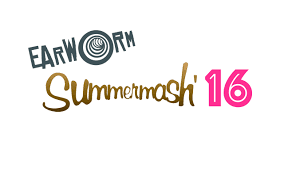

# **Mashup Defense**

 

DJ Earworm has been around for a couple of years, creating mixes and blends that capture the spirit of the summer using the yearly hits. The majority of his mash-ups are composed from the instrumental and vocal tracks of about 15 songs. Since he produces his songs under DJ Earworm, his songs can be defined as _pseudonymous works_ because they are phonorecords of which the author is identified under a fictitious name.  
The purpose of this is to analyze the  [DJ Earworm's Summer '16 Mashup](http://djearworm.com/Mashups.php) to prove that it should be considered Fair Use. Since all of the songs are released with a corresponding music video that uses the tidbits of the music videos produced for the songs in the mash-up, I think it is important to also explore the legality of those.  In order to fairly analyze this mashup, we will consider the same four factors that judges consider in judicial cases of Fair Use.

###**The four factors judges consider in cases of Fair Use are**:

* The purpose and character of its use
* The nature of the copyrighted work
* The amount and sustainability of the portion taken
* The effect of the use upon the potential market

##**Defense**

1. _The purpose and character of its use:_  
	As defined by the [17 U.S. Code](https://www.law.cornell.edu/uscode/text/17/101), it can be considered a _collective work_. This Mashup is completely **transformative**. It takes video footage and lyrical work from 19 different songs and creates a new work with a blended melody. DJ Earworm's staple sound makes this mashup **original** and new. By combining several instrumental tracks with the vocals of other tracks, the mash-up is new and not just an imitation piece. I particularly noticed the change of Twenty One Pilots verse "wish we could turn back time", from their hit Stressed Out, is slowed down. The songs in the mash-up were created to serve as independent works that match each other. When they were all put together over a different beat, they became a  musical representation of the past year. The video clips are spread out throughout the video to create another completely different tone for the new song. Most of them are clips of the artists laughing and dancing, setting a fun, summer-y atmosphere for the mash-up. The compilation exists to make several different parts into a whole. 
2. _The nature of the copyrighted work:_  
	The nineteen songs and their music video clips that compose this mash-up are published works by published artists and producers. It is stated in the Fair Use act, that it is more likely to be considered not Fair Use if the works are unpublished. The vocal tracks are sped up and the pitches are altered to fit into each other. If the songs stayed original, they would not mesh as well. In no instance does DJ Earworm claim rights or ownership of these songs. As the biggest hits of the year, they are very well known and recognizable by the majority. The cinematography of the music videos are not as recognizable which makes the line a little blurrier. It is a little unclear which clips belong to which songs. While there are some parts that the words match up with the artist singing, it does not give these hardworking producers, dancers, directors and many others the credit they deserve. With little work, I am sure the clip could be linked to one of the songs, but it is not readily accessible information. 
3. _The amount and substantiality of the portion taken:_  
	The snippets used in the Summer Mashup '16 are enough to be discernible, but not enough to misappropriate their identities. It can be argued that this mash-up is more Fair Use than others in the mashup/remix genre because of its use of more than ten songs. There is a substantial amount of some of the videos used in the mashup, but they are spread out and not used to represent just one song.
4. _The effect of the use upon the potential market:_  
	The 17 U.S. Code defines “financial gain” as inclusive of receipt, or expectation of receipt, of anything of value, including the receipt of other copyrighted works. Under that definition, DJ Earworm has no intention of making money from his music from the moment he begins creating it. Therefore his music is undoubtedly fair. In an interview with DJ Earworm, that can be found [here](http://www.digitaldjtips.com/2011/02/dj-earworm-interview-i-prefer-to-call-myself-a-data-jockey/), he says the songs provide no financial gain for him.  

>Interviewer: And if you don't mind me asking, how do you actually earn your income? I mean, I presume you can't make any money off the mash-ups themselves?  
>DJ Earworm: No, I don't sell my mash-ups - I don't get anything from sales. When I put stuff together it's more promotional.  
 
Although his mash-ups appear directly fair, it is important to look at an indirect outcome. He is a well-known DJ that makes a living out of his work. People do not pay for the songs, but they pay to have him play them at their parties. It is beneficial to DJ Earworm, but hardly _harmful_ to the original artists. He is not docking their sales or stealing their fans, he is uniting them. He used Taylor Swift's "Shake It Off" in 2014 and she is notorious for CopyRight lawsuits. 

In summation, DJ Earworm's Summer '16 Mash Up does not violate CopyRight laws under Fair Use. His intentions were pure and he did not cause discredit or harm to any of the artists on the track. I can assume that the artists may even enjoy his compilations because they bring light to new aspects of their songs. Even though Fair Use laws are generally vague, a valid argument can be made for most cases.

##**Summary**
| Factors | Justification |
|:-----   | :----: |
|The purpose and character of its use| Transformative |
|The nature of the copyrighted work| Created from published works |
|The amount and sustainability of the portion taken| Used small portions of 19 different songs/clips |
|The effect of the use upon the potential market | DJ Earworm makes no direct money from his work |

Visit his [site](djearworm.com) for more mash-ups like this one. 
